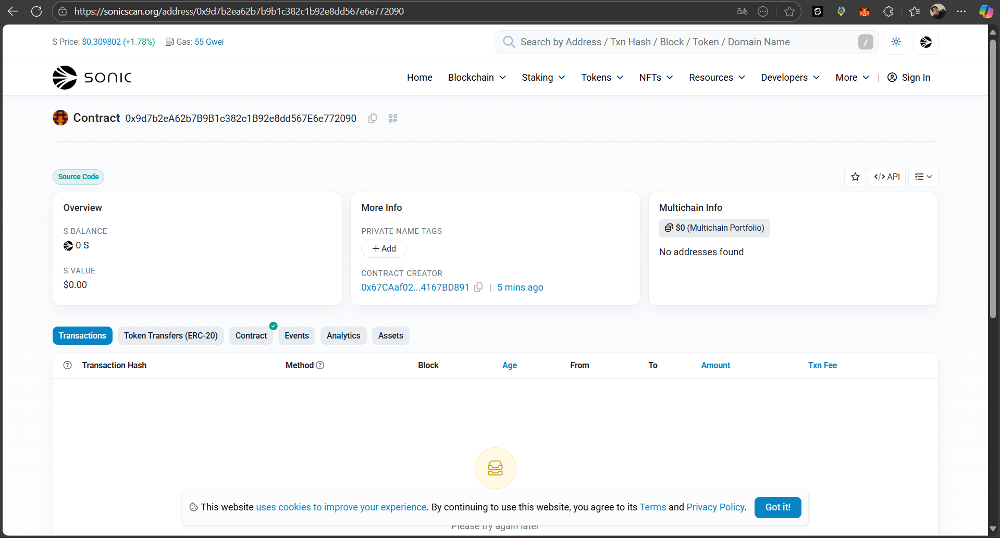

# Contrato Inteligente TransactionManager



[](https://sonicscan.org/address/0x9d7b2ea62b7b9b1c382c1b92e8dd567e6e772090#code)
[](https://sonicscan.org/address/0x9d7b2ea62b7b9b1c382c1b92e8dd567e6e772090#code)
[](https://sepolia.etherscan.io/address/0x760156ee5d01bd779f03556083555bd6836d358a)

## Foundry

**Foundry es un conjunto de herramientas rápido, portátil y modular para el desarrollo de aplicaciones Ethereum escrito en Rust.**

Foundry consiste en:

-   **Forge**: Framework de testing para Ethereum (similar a Truffle, Hardhat y DappTools).
-   **Cast**: Navaja suiza para interactuar con contratos inteligentes EVM, enviar transacciones y obtener datos de la cadena.
-   **Anvil**: Nodo local de Ethereum, similar a Ganache o Hardhat Network.
-   **Chisel**: REPL de Solidity rápido y utilitario.

## Documentación

https://book.getfoundry.sh/

## Uso

### Compilar

```shell
$ forge build
```

### Testear

```shell
$ forge test
```

### Formatear

```shell
$ forge fmt
```

### Gas Snapshots

```shell
$ forge snapshot
```

### Anvil

```shell
$ anvil
```

### Desplegar TransactionManager

Para desplegar el contrato TransactionManager:

**Sepolia Testnet:**
```shell
# Cargar variables de entorno
$ source .env
# Desplegar y verificar en Sepolia
$ forge script script/DeployTransactionManager.sol:DeployTransactionManagerScript --rpc-url $RPC_URL_SEPOLIA --private-key $PRIVATE_KEY --chain-id 11155111 --broadcast --verify --etherscan-api-key $ETHERSCAN_API_KEY
```

**Sonic Mainnet:**
```shell
# Cargar variables de entorno
$ source .env
# Desplegar y verificar en Sonic Mainnet
$ forge script script/DeployTransactionManager.sol:DeployTransactionManagerScript --rpc-url $RPC_URL_SONIC --private-key $PRIVATE_KEY --chain-id 146 --broadcast --verify --verifier-url https://api.sonicscan.org/api --etherscan-api-key $ETHERSCAN_API_KEY
```

#### Contratos Desplegados

**Sepolia Testnet:**
- **Dirección del Contrato:** `0x760156EE5D01BD779F03556083555bd6836d358a`
- **Etherscan:** [https://sepolia.etherscan.io/address/0x760156ee5d01bd779f03556083555bd6836d358a](https://sepolia.etherscan.io/address/0x760156ee5d01bd779f03556083555bd6836d358a)

**Sonic Mainnet:**
- **Dirección del Contrato:** `0x9d7b2ea62b7b9b1c382c1b92e8dd567e6e772090`
- **SonicScan:** [https://sonicscan.org/address/0x9d7b2ea62b7b9b1c382c1b92e8dd567e6e772090#code](https://sonicscan.org/address/0x9d7b2ea62b7b9b1c382c1b92e8dd567e6e772090#code)
- **Red:** Sonic Mainnet (Chain ID: 146)
- **Estado:** ✅ Verificado

### Contrato TransactionManager

`TransactionManager` es un contrato inteligente para gestionar y ejecutar transacciones entre usuarios, soportando ETH y otras monedas (la lógica para tokens puede extenderse).

#### Funcionalidades principales
- Crear transacciones especificando destinatario, monto y moneda.
- Ejecutar transacciones en ETH (con verificación de valor).
- Consultar transacciones por usuario o estado pendiente.

#### Pruebas

Las pruebas unitarias están en `test/TransactionManager.t.sol`:

```shell
$ forge test --match-contract TransactionManagerTest
```

#### Ejemplo de Uso

```solidity
// Crear una transacción
uint256 txId = transactionManager.createTransaction(destinatario, 1 ether, "ETH");
// Ejecutar la transacción (ETH)
transactionManager.executeTransaction{value: 1 ether}(txId);
```

#### Interactuar con Contratos Desplegados

**Sonic Mainnet:**
```javascript
// Dirección del contrato y ABI para integración con frontend
const CONTRACT_ADDRESS = "0x9d7b2ea62b7b9b1c382c1b92e8dd567e6e772090";
const SONIC_CHAIN_ID = 146;
const SONIC_RPC = "https://rpc.soniclabs.com";
```
