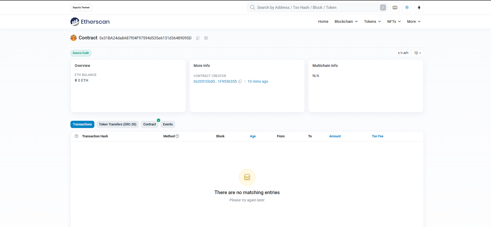

# AIni Pay - Contrato Inteligente TransactionManager




[](https://sonicscan.org/address/0x9d7b2ea62b7b9b1c382c1b92e8dd567e6e772090#code)
[](https://sonicscan.org/address/0x9d7b2ea62b7b9b1c382c1b92e8dd567e6e772090#code)
[](https://sepolia.etherscan.io/address/0x760156ee5d01bd779f03556083555bd6836d358a)

## Foundry

**Foundry es un kit de herramientas ultrarrápido, portátil y modular para el desarrollo de aplicaciones Ethereum escrito en Rust.**

Foundry consiste en:

-   **Forge**: Framework de pruebas para Ethereum (como Truffle, Hardhat y DappTools).
-   **Cast**: Navaja suiza para interactuar con contratos inteligentes EVM, enviar transacciones y obtener datos de la cadena.
-   **Anvil**: Nodo local de Ethereum, similar a Ganache, Hardhat Network.
-   **Chisel**: REPL de Solidity rápido, utilitario y detallado.

## Documentación

https://book.getfoundry.sh/

## Uso

### Compilar

```shell
$ forge build
```

### Probar

```shell
$ forge test
```

### Formatear

```shell
$ forge fmt
```

### Snapshots de Gas

```shell
$ forge snapshot
```

### Anvil

```shell
$ anvil
```


### Desplegar TransactionManager

Para desplegar el contrato TransactionManager:

```shell
# Cargar variables de entorno
$ source .env
# Desplegar y verificar en Sepolia
$ forge script script/DeployTransactionManager.sol:DeployTransactionManagerScript --rpc-url $RPC_URL_SEPOLIA --private-key $PRIVATE_KEY --chain-id 11155111 --broadcast --verify --etherscan-api-key $ETHERSCAN_API_KEY
```

#### Contratos Desplegados

**Red de Pruebas Sepolia:**
- **Dirección del Contrato:** `0x31BA24da8A87f04F97594d535e6131d36489095D`
- **Etherscan:** [https://sepolia.etherscan.io/address/0x31ba24da8a87f04f97594d535e6131d36489095d](https://sepolia.etherscan.io/address/0x31ba24da8a87f04f97594d535e6131d36489095d)

### Contrato TransactionManager

`TransactionManager` es un contrato inteligente para gestionar y ejecutar transacciones entre usuarios, compatible con ETH y otras monedas (la lógica para tokens puede extenderse).

#### Características Principales
- Crear transacciones especificando destinatario, cantidad y moneda.
- Ejecutar transacciones ETH (con verificación de valor).
- Consultar transacciones por usuario o estado pendiente.

#### Pruebas

Se proporcionan pruebas unitarias en `test/TransactionManager.t.sol`:

```shell
$ forge test --match-contract TransactionManagerTest
```

#### Ejemplo de Uso

```solidity
// Crear una transacción
uint256 txId = transactionManager.createTransaction(recipient, 1 ether, "ETH");
// Ejecutar la transacción (ETH)
transactionManager.executeTransaction{value: 1 ether}(txId);
```

#### Interactuar con Contratos Desplegados

**Red de Pruebas Sepolia:**
```javascript
// ABI del contrato y dirección para integración frontend
const CONTRACT_ADDRESS = "0x31BA24da8A87f04F97594d535e6131d36489095D";
const SEPOLIA_CHAIN_ID = 11155111;
const SEPOLIA_RPC = "https://sepolia.infura.io/v3/YOUR_INFURA_KEY";
```

### Cast

```shell
$ cast <subcommand>
```

### Ayuda

```shell
$ forge --help
$ anvil --help
$ cast --help
```
